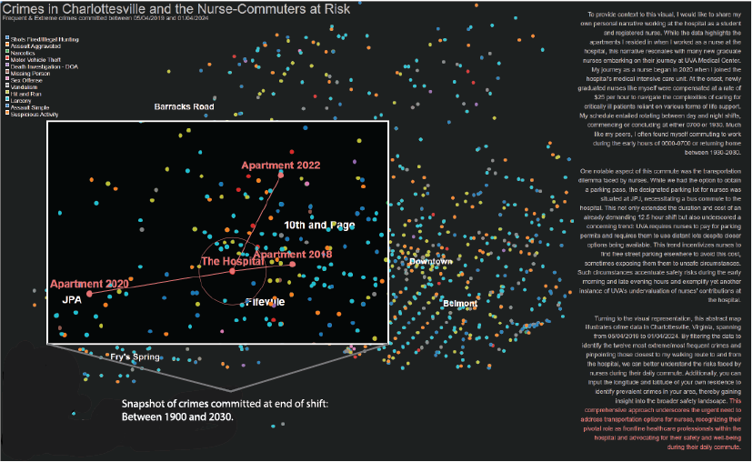

# Purpose
For this project, my goal was to highlight the urgent need for improved transportation options for nurses by analyzing crime data in Charlottesville, VA.
The final product of the visualizations can be accessed through the Observable Platform: https://observablehq.com/d/7793c014b3511066.
Additionally, the embedded URL for this notebook can be viewed here: https://observablehq.com/embed/7793c014b3511066@659?cells=svgContainer.

# Data
I focused on the period from 05/04/2019 to 01/04/2024, mapping out common walking routes to and from the hospital from three distinct apartments where I lived while working as a nurse. I sourced the data from the Charlottesville Police Department website. Although the original police data did not include longitude and latitude columns, I used the GoogleMaps API to convert the address included in the dataset to the corresponding longitudes and latitudes. 

# Static Visualization of My Work

